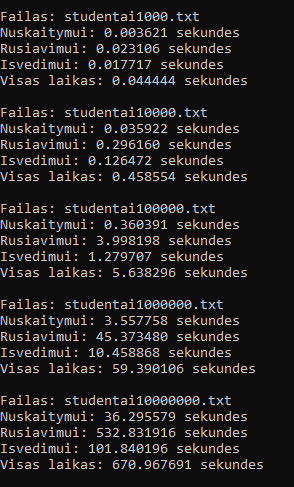

# v0.4
Laboratorinio darbo V0.4 versija
1. Naudotojas pasirenki ar skaičiuoti vidurkį ar medianą
2. Nuskaito duomenis iš failo arba įvedimo ir tikrina ar jie teisingi
3. Naudotojas pasirenka kaip nori duomenis įvesti, nuskaityti iš failų ar sugeneruoti
4. Naudotojas pasirenka kada nori baigti įvedinėti duomenis
5.  Pasirenka kaip nori rūšiuoti duomenis
6. Galutinis rezultatas išvedamas arba konsolėje, arba skirstomi į du failus.

Projektas:
1. Dinamiškai paskiria atmintį pagal duomenis
2. Gali sugeneruoti penkis studentų sąrašų failus, nuo 1000 iki 10000000 eilučių dydžio, su jais atlikti tyrimus.
3. Išskaidytas į kelis failus

## Tyrimo rezultatai

| Failo dydis | Skaitymo laikas  | Rūšiavimo laikas | Išvedimo laikas  |
|-------------|------------------|------------------|------------------|
| 1 000       | 0.002s           | 0.001s           | 0.001s           |
| 10 000      | 0.085s           | 0.024s           | 0.019s           |
| 100 000     | 0.837s           | 0.243s           | 0.195s           |
| 1 000 000   | 8.395s           | 2.657s           | 1.940s           |
| 10 000 000  | 86.659s          | 33.528s          | 20.298s          |

=======

