# v1.0

# Instrukcija

- Atsidarykite command promt, nueikite į vietą kur norėsite turėti programą

```
cd <dokumento nuoroda, pvz C:\Users\JohnDoe\Documents\>
```
- Atsisiųskite programą
```
git clone https://github.com/n1ght3lf/V1
```

- Jei turite UNIX OS, paleiskite
```
make
```
- kitu atveju atsisiųskite MobaXterm ( https://mobaxterm.mobatek.net/ ), instaliuokite ir tada atidarykite faile kuriame yra problema, tada (jei parašys kad neinstaliuota, tai sutikite su instaliacija ir vėl paleiskite)

```
make
```

- Paleiskite programą

- UNIX:
```
./main
```
- WINDOWS:
```
main
```
### Naudojimasis

- Paleidus programą bus pateiktas meniu kuris parodys visas funkcijas kai prie jų prieisite. Parašysit numerį ir paspausit Enter, kad judėti toliau.

### Funkcijos:
- Nuskaito duomenis ir tikrina ar teisingi
- Leidžia pasirinkti tarp penkių įvedimo būdų, vieno generavimo ir vieno testavimo
- Testuojant failus apskaičiuoja laiką
- Dinamiškai paskiria atmintį
- Generuoja failus 5 skirtingų dydžių.
- Generuojant kartu ir testuoja kiek laiko kiekvienas failas užima kiekvienam etape.
- Jei išvedami rezultatai į failus, failai rūšiuojami pagal pažymius.
- Yra 3 konteinerio tipai (vector, deque ir list) ir 3 skirtingos strategijos duomenų skirstymui

### Valymas
- clean išvalo objektus (.o), o distclean išvalo visus sukurtus failus
```
make clean
make distclean
```

### Optimizavimas


- Be optimizacijos

  |           | Greitis(1mln.) | Greitis(10mln.) | Failo dydis  |
  |-----------|----------------|-----------------|--------------|
  | Class     |    13.2770     |    156.2178     |    642KB     |

    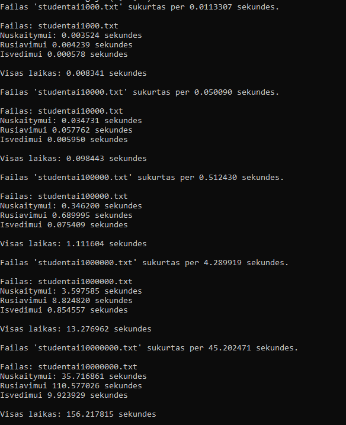
    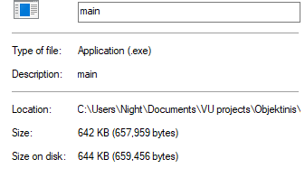


- O1 optimizacija

  |           | Greitis(1mln.) | Greitis(10mln.) | Failo dydis  |
  |-----------|----------------|-----------------|--------------|
  | Class     |    5.03360     |    51.12527     |    328KB     |

    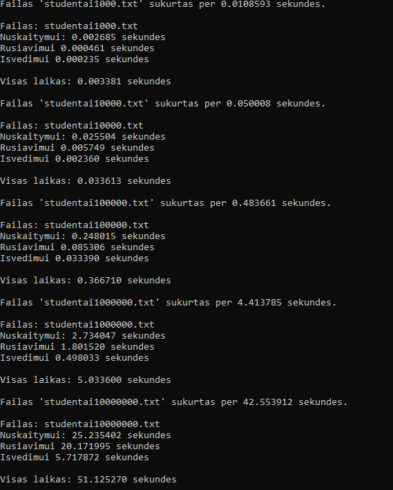
    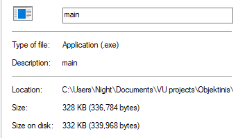


- O2 optimizacija

  |           | Greitis(1mln.) | Greitis(10mln.) | Failo dydis  |
  |-----------|----------------|-----------------|--------------|
  | Class     |    4.36167     |    50.75928     |    309KB     |

    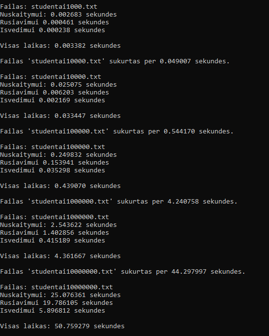
    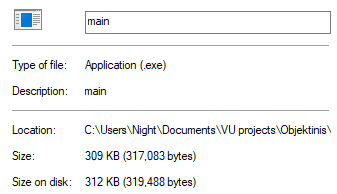

- O3 optimizacija

  |           | Greitis(1mln.) | Greitis(10mln.) | Failo dydis  |
  |-----------|----------------|-----------------|--------------|
  | Class     |    4.87037     |    52.20442     |    314KB     |


    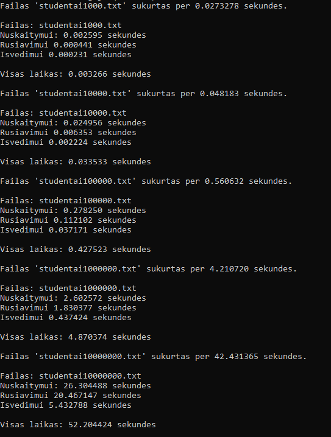
    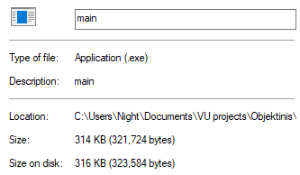

<details>
    <summary> Strategijos </summary>

## Rezultatai

- Vector 1 strategija

| Failo dydis | Skaitymo laikas  | Rūšiavimo laikas | Išvedimo laikas  |
|-------------|------------------|------------------|------------------|
| 1 000       | 0.0036           | 0.0042           | 0.0005           |
| 10 000      | 0.0353           | 0.0526           | 0.0056           |
| 100 000     | 0.3860           | 0.7453           | 0.0603           |
| 1 000 000   | 3.9041           | 9.6643           | 0.7174           |
| 10 000 000  | 35.0132          | 111.360          | 8.5941           |

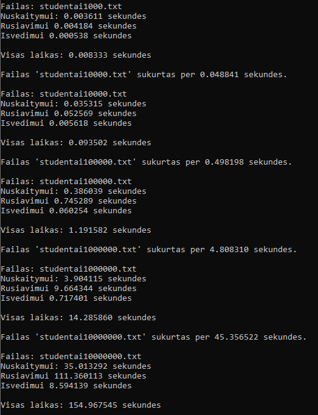

- Vector 2 strategija

| Failo dydis | Skaitymo laikas  | Rūšiavimo laikas | Išvedimo laikas  |
|-------------|------------------|------------------|------------------|
| 1 000       | 0.0038           | 0.0043           | 0.0006           |
| 10 000      | 0.0351           | 0.0871           | 0.0074           |
| 100 000     | 0.3732           | 0.7692           | 0.0927           |
| 1 000 000   | 3.5262           | 9.1534           | 0.7031           |
| 10 000 000  | 35.3850          | 117.234          | 8.3022           |

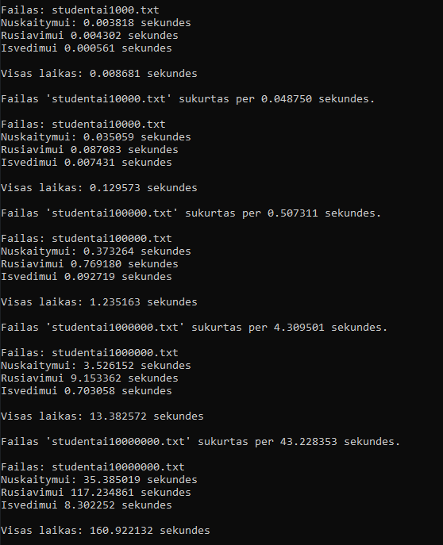

- Vector 3 strategija

| Failo dydis | Skaitymo laikas  | Rūšiavimo laikas | Išvedimo laikas  |
|-------------|------------------|------------------|------------------|
| 1 000       | 0.0035           | 0.0043           | 0.0007           |
| 10 000      | 0.0353           | 0.0525           | 0.0067           |
| 100 000     | 0.3817           | 0.7121           | 0.0744           |
| 1 000 000   | 3.4521           | 8.5524           | 0.8672           |
| 10 000 000  | 36.4035          | 105.653          | 9.3462           |

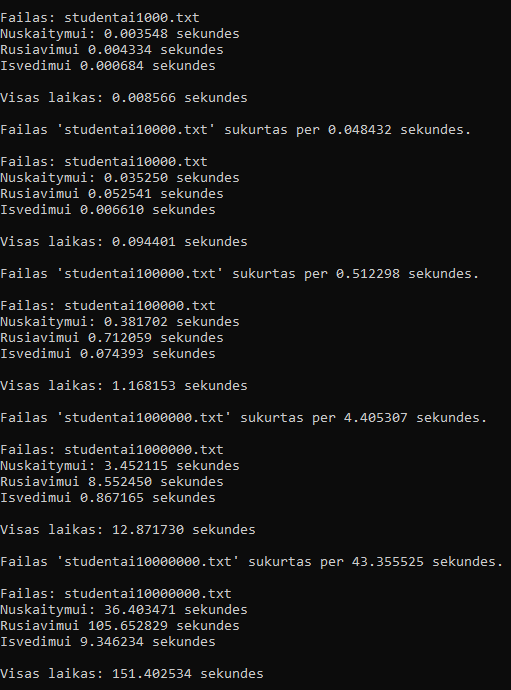

- Deque 1 strategija

| Failo dydis | Skaitymo laikas  | Rūšiavimo laikas | Išvedimo laikas  |
|-------------|------------------|------------------|------------------|
| 1 000       | 0.0037           | 0.0044           | 0.0005           |
| 10 000      | 0.0344           | 0.0543           | 0.0048           |
| 100 000     | 0.3447           | 0.7113           | 0.0608           |
| 1 000 000   | 3.4821           | 8.8966           | 0.6684           |
| 10 000 000  | 34.6972          | 108.312          | 8.0477           |

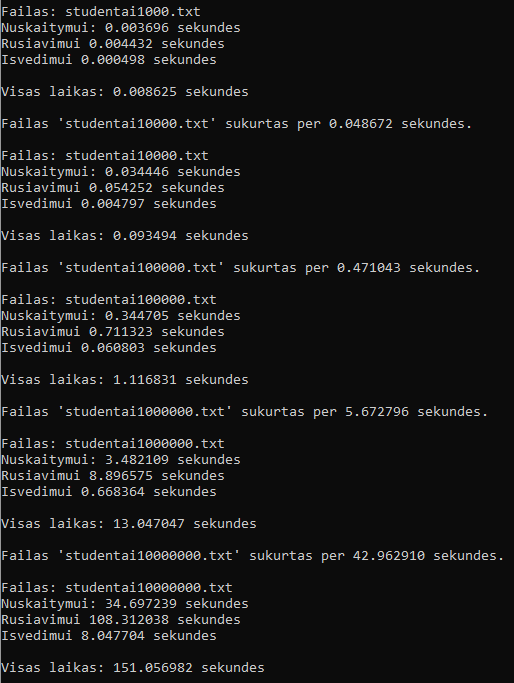

- Deque 2 strategija

| Failo dydis | Skaitymo laikas  | Rūšiavimo laikas | Išvedimo laikas  |
|-------------|------------------|------------------|------------------|
| 1 000       | 0.0036           | 0.0047           | 0.0006           |
| 10 000      | 0.0503           | 0.0585           | 0.0056           |
| 100 000     | 0.3594           | 0.8200           | 0.0690           |
| 1 000 000   | 3.5770           | 9.8510           | 0.7259           |
| 10 000 000  | 35.2041          | 121.844          | 7.9257           |

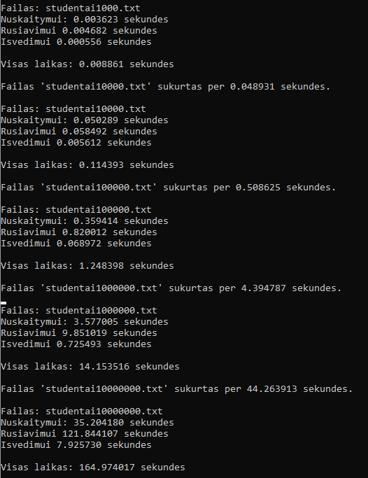

-Deque 3 strategija

| Failo dydis | Skaitymo laikas  | Rūšiavimo laikas | Išvedimo laikas  |
|-------------|------------------|------------------|------------------|
| 1 000       | 0.0036           | 0.0043           | 0.0006           |
| 10 000      | 0.0343           | 0.5357           | 0.0059           |
| 100 000     | 0.3508           | 0.6994           | 0.7697           |
| 1 000 000   | 3.4591           | 8.9712           | 0.8492           |
| 10 000 000  | 36.0661          | 109.312          | 10.231           |

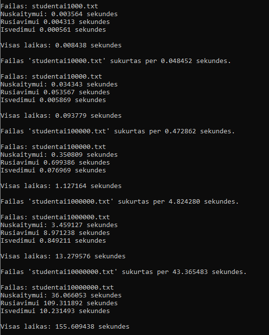

- List 1 strategija

| Failo dydis | Skaitymo laikas  | Rūšiavimo laikas | Išvedimo laikas  |
|-------------|------------------|------------------|------------------|
| 1 000       | 0.0037           | 0.0030           | 0.0006           |
| 10 000      | 0.0356           | 0.0423           | 0.0058           |
| 100 000     | 0.3780           | 0.6128           | 0.0897           |
| 1 000 000   | 3.6181           | 8.3617           | 0.9696           |
| 10 000 000  | 34.4123          | 94.2010          | 10.058           |

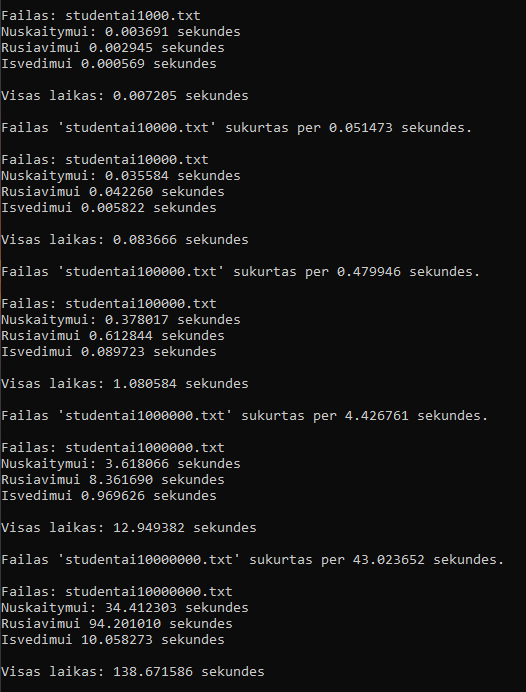

- List 2 strategija

| Failo dydis | Skaitymo laikas  | Rūšiavimo laikas | Išvedimo laikas  |
|-------------|------------------|------------------|------------------|
| 1 000       | 0.0036           | 0.0029           | 0.0006           |
| 10 000      | 0.0354           | 0.0446           | 0.0063           |
| 100 000     | 0.3553           | 0.6185           | 0.0906           |
| 1 000 000   | 3.4843           | 8.3737           | 0.9306           |
| 10 000 000  | 34.9684          | 99.9578          | 10.216           |

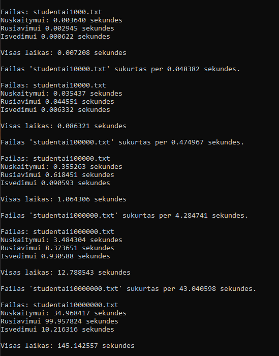

- List 3 strategija

| Failo dydis | Skaitymo laikas  | Rūšiavimo laikas | Išvedimo laikas  |
|-------------|------------------|------------------|------------------|
| 1 000       | 0.0035           | 0.0030           | 0.0007           |
| 10 000      | 0.0347           | 0.0429           | 0.0069           |
| 100 000     | 0.3545           | 0.6006           | 0.1130           |
| 1 000 000   | 3.4999           | 7.5365           | 1.2169           |
| 10 000 000  | 147.641          | 97.7937          | 14.651           |

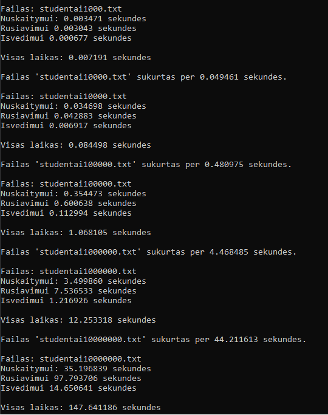

</details>

### Apibendrinimas

- Tarp trijų konteinerių skirtumo itin didelio nebuvo, išskyrus list su 3 strategija skaitymo laiko. List ir Deque rūšiavo per mažą skirtumą (<10%) greičiau ir 3 strategija bendrai pagreitino darbo laiką, nors ir ne per didelį kiekį. Pagal šiuos duomenis galima teigti, kad strategija ir konteinerio tipas gali paveikti programos veikimo laiką, tačiau tai nebus itin didelis pokytis.

### Visų versijų aprašymas

-NOTE: versijos turi visą funkcionalumą praeitos versijos, tai nekartosiu kiekvieno dalyko.

-v.pradinė: Nuskaito įvestį, leidžia vartotojui pasirinkti tarp medianos ir vidurkio skaičiuojant galutinį balą.

-v0.1: Dinamiškai paskiria atmintį, atsiranda daugiau būdų įvesti/generuoti duomenis.

-v0.2: Nuskaito ne tik įvestį, bet ir failus. Atidaro testavimo failus ir skaičiuoja laiką, išveda duomenis ir failuose.

-v0.3: Klaidų gaudymas įvedime, projektas išskaidytas į daug failų.

-v0.4: Galimybė generuoti penkis failus 1000-10000000 įrašų dydžio. Atlieka tyrimus su failais. Surūšiuoja studentus į du failus pagal balus.

-v0.1: Vector, Deque ir List konteinerio tipai.